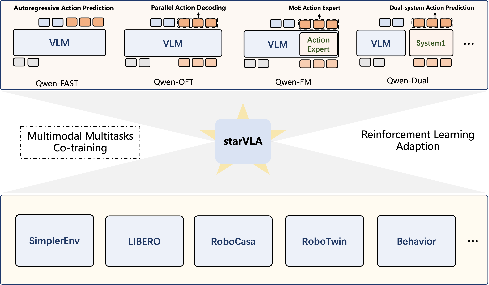

# FineVLA-Policy

[](https://arxiv.org/abs/xxxx.xxxxx)
[](https://huggingface.co/FineVLA)
[](https://github.com/EricsXt/FineVLA)

**FineVLA-Policy** is the policy training and evaluation component of [FineVLA](https://github.com/EricsXt/FineVLA), a unified framework for fine-grained instruction alignment in Vision-Language-Action learning. Built on the [StarVLA](https://github.com/starVLA/starVLA) codebase, FineVLA-Policy trains VLA policies with action-aligned, fine-grained language supervision to enable **steerable robotic control** — policies that not only complete tasks, but follow instructions about *how* to execute them.

<p align="center">
  
</p>

## Overview

Existing VLA models are trained with coarse goal-level instructions (e.g., "pick up the cup"), which collapse many distinct execution strategies into the same language label. FineVLA-Policy addresses this by training with **fine-grained, action-aligned instructions** generated by [FineVLA-Tool](https://github.com/EricsXt/FineVLA), covering ten control-relevant dimensions:

- **Action Sequence** — step-by-step execution order
- **Active Actor** — which arm or end-effector to use
- **Target Object** — object disambiguation
- **Initial / Final Configuration** — start and end states
- **Contact & Approach** — where and how to make contact
- **Trajectory & Orientation** — motion path and tool orientation
- **Body Motion** — full-body or joint-level movement
- **Object Interaction** — how objects relate during manipulation
- **Failure & Recovery** — error handling behavior

Our experiments show that **mixing fine-grained (FG) and raw goal-level instructions at a 1:2 to 1:1 ratio** yields the best performance — an inverted-U trend consistent across simulation (RoboTwin) and real-world (dual-arm ALOHA) settings.

## Key Results

### RoboTwin Simulation

| FG:Raw Ratio | RDT-OFT (Easy/Hard) | RDT-GR00T (Easy/Hard) | Aloha Mix-OFT (Easy/Hard) |
|:---:|:---:|:---:|:---:|
| Raw-only | 61.5 / 60.0 | 55.1 / 53.4 | 71.8 / 71.4 |
| FG:Raw = 1:4 | 68.2 / 66.5 | 58.2 / 55.7 | 75.3 / 74.3 |
| FG:Raw = 1:2 | **74.1** / 72.1 | 61.7 / 60.9 | 82.8 / 78.6 |
| FG:Raw = 1:1 | 73.9 / **72.4** | **69.4** / **68.2** | **86.8** / **82.5** |
| FG:Raw = 2:1 | 70.4 / 68.3 | 65.9 / 63.1 | 80.9 / 79.3 |
| FG:Raw = 4:1 | 68.6 / 67.5 | 64.9 / 63.2 | 79.5 / 78.5 |
| FG-only | 62.9 / 62.0 | 62.1 / 61.5 | 78.3 / 76.1 |

### Real-World Dual-Arm (100-point scale)

| Supervision | Clean Table | Stack Block | Color | Pose | Approach | Rotate | Arm | L→R (OOD) | Avg (ID) | Avg (All) |
|:---:|:---:|:---:|:---:|:---:|:---:|:---:|:---:|:---:|:---:|:---:|
| Raw-only | 72 | 35 | 22 | 24 | 60 | 76 | 60 | 0 | 49.9 | 43.6 |
| FG:Raw = 1:4 | 76 | 36 | 28 | 32 | 65 | 79 | 61 | 0 | 53.9 | 47.1 |
| FG:Raw = 1:2 | 79 | 39 | 36 | **48** | 76 | **87** | 63 | 5 | 61.1 | 54.1 |
| FG:Raw = 1:1 | **84** | **40** | **40** | 47 | **78** | 86 | **64** | **10** | **62.7** | **56.1** |
| FG:Raw = 2:1 | 80 | 38 | 34 | 42 | 72 | 83 | 62 | 5 | 58.7 | 52.0 |
| FG:Raw = 4:1 | 74 | 37 | 31 | 43 | 72 | 83 | 62 | 5 | 57.4 | 50.9 |
| FG-only | 70 | 35 | 25 | 41 | 70 | 80 | 60 | 0 | 54.4 | 47.6 |

## Supported Frameworks

FineVLA-Policy supports multiple VLA architectures through a modular design:

| Framework | Action Head | Description |
|-----------|-----------|-------------|
| **StarVLA-OFT** | MLP | Parallel decoding of continuous actions (OpenVLA-OFT style) |
| **StarVLA-GR00T** | DiT (Flow Matching) | Dual-system: VLM for reasoning + DiT for action prediction (GR00T style) |
| **StarVLA-PI** | Flow Matching | Diffusion-based continuous action prediction (pi_0 style) |
| **StarVLA-FAST** | FAST Tokenizer | Autoregressive discrete action tokens (pi_0-FAST style) |

All frameworks share a **Qwen3.5-VL-4B** backbone and follow the same training and evaluation API.

## Installation

```bash
# Clone the repo
git clone https://github.com/EricsXt/FineVLA.git
cd FineVLA/FineVLA-Policy

# Create conda environment
conda create -n finevla python=3.10 -y
conda activate finevla

# Install requirements
pip install -r requirements.txt

# Install FlashAttention2
pip install flash-attn --no-build-isolation

# Install the package
pip install -e .
```

<details>
<summary><b>Common Issues</b></summary>

`flash-attn` must match your CUDA toolkit and PyTorch versions. Check your environment:

```bash
nvcc -V
pip list | grep -E 'torch|transformers|flash-attn'
```

We have verified that `flash-attn==2.7.4.post1` works well with CUDA `12.0` and `12.4`.

</details>

## Quick Start

### Smoke Test

```bash
# Verify framework builds correctly
python starVLA/model/framework/QwenGR00T.py
```

Download [Qwen3.5-VL-4B-Instruct](https://huggingface.co/Qwen/Qwen3.5-VL-4B-Instruct) and place it at `./playground/Pretrained_models/Qwen3.5-VL-4B-Instruct`. The script will build the model and print its architecture.

### Training

FineVLA-Policy uses Accelerate + DeepSpeed for distributed training:

```bash
accelerate launch \
  --config_file starVLA/config/deepseeds/deepspeed_zero2.yaml \
  --num_processes 8 \
  starVLA/training/train_starvla.py \
  --config_yaml ./starVLA/config/training/your_config.yaml
```

Benchmark-specific training scripts are provided under [`examples/`](examples/):

- [`examples/Aloha/`](examples/Aloha/) — ALOHA dual-arm tasks with FG:Raw mixing ratios
- [`examples/Robotwin/`](examples/Robotwin/) — RoboTwin simulation benchmark
- [`examples/LIBERO/`](examples/LIBERO/) — LIBERO benchmark
- [`examples/Robocasa_tabletop/`](examples/Robocasa_tabletop/) — RoboCasa tabletop tasks
- [`examples/SimplerEnv/`](examples/SimplerEnv/) — SimplerEnv evaluation

**Example: Train with FG:Raw = 1:1 on ALOHA data**

```bash
bash examples/Aloha/run_qwen35_GR00T_aloha_multi_FG1_1_dlc.sh
```

### Evaluation

Each benchmark directory under `examples/` contains its own evaluation guide. For a quick start with LIBERO:

```bash
# Start the policy server
bash examples/LIBERO/eval_files/run_policy_server.sh &

# Run evaluation
bash examples/LIBERO/eval_files/eval_libero.sh
```

## Project Structure

```
FineVLA-Policy/
├── starVLA/
│   ├── model/
│   │   ├── framework/          # VLA frameworks (QwenGR00T, QwenOFT, QwenPI, QwenFast, ...)
│   │   └── modules/            # Reusable components (VLM, action heads, vision encoders)
│   ├── dataloader/             # Data pipeline (LeRobot format, VLM data)
│   ├── training/               # Training loops (VLA, VLA+VLM co-training, VLM-only)
│   └── config/                 # YAML configs and DeepSpeed settings
├── examples/                   # Benchmark-specific training & eval scripts
├── deployment/                 # Model serving and deployment
├── scripts/                    # Utility scripts
├── requirements.txt
└── pyproject.toml
```

### Key Design Principles

- **Model-agnostic dataloader**: Returns raw dicts `{image, lang, action, state}` — no model-specific preprocessing in the data pipeline.
- **Unified framework API**: `framework.forward()` for training loss, `framework.predict_action()` for inference.
- **CLI overrides**: Any config key can be overridden from the command line via OmegaConf.
- **Per-module learning rates**: Set different learning rates for VLM backbone vs. action head.

## FineVLA Ecosystem

FineVLA-Policy is part of the larger FineVLA framework:

| Component | Description |
|-----------|-------------|
| [**FineVLA-Tool**](https://github.com/EricsXt/FineVLA) | Data pipeline for constructing fine-grained, action-aligned instruction supervision |
| [**RoboFine-VLM**](https://huggingface.co/FineVLA) | Vision-language model fine-tuned for robotic action understanding and annotation |
| [**RoboFine-Bench**](https://github.com/EricsXt/FineVLA) | Benchmark for evaluating fine-grained robotic video understanding (VQA + Captioning) |
| **FineVLA-Policy** (this repo) | VLA policy training with fine-grained instruction supervision |

## Citation

```bibtex
@article{hu2026finevla,
  title={FineVLA: Fine-Grained Instruction Alignment for Steerable Vision-Language-Action Policies},
  author={Hu, Xintong and Huang, Xuhong and Zhang, Jinyu and Yao, Yutong and Sun, Yuchong and Wang, Qiuyue and Li, Mingsheng and Liu, Yitao and Chen, Yixuan and Zheng, Yingming and Bai, Shuai and Yu, Tao},
  year={2026}
}
```

## Acknowledgements

FineVLA-Policy is built on top of [StarVLA](https://github.com/starVLA/starVLA). We also gratefully acknowledge:

- [LeRobot](https://github.com/huggingface/lerobot)
- [GR00T](https://github.com/NVIDIA/Isaac-GR00T)
- [DeepSpeed](https://github.com/deepspeedai/DeepSpeed)
- [Qwen-VL](https://github.com/QwenLM/Qwen3.5-VL)

## License

This project is released under the [MIT License](LICENSE).
