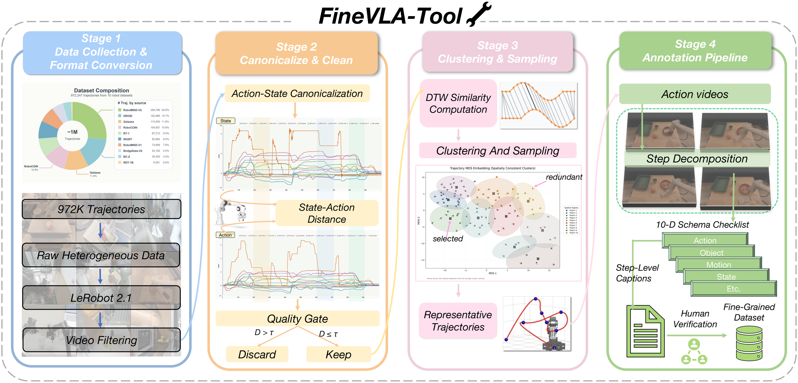

# FineVLA-Tool

Data construction pipeline for **FineVLA**: from raw heterogeneous robot datasets to fine-grained, action-aligned annotations.

## Pipeline Overview

<p align="center">
  
</p>

FineVLA-Tool converts large-scale heterogeneous robot demonstrations into action-aligned fine-grained instruction data through four stages:

1. **CanonicalizeAndClean** — Raw trajectories from 10 open-source datasets are converted into a unified 80-dim state/action representation, and quality filters remove invalid videos, corrupted, or inconsistent trajectories.
2. **ClusteringAndSampling** — DTW-based similarity computation and clustering identify representative trajectories, reducing redundancy while preserving diverse manipulation strategies.
3. **AnnotationPipeline** — Selected trajectories are decomposed into step-level descriptions and annotated with a ten-dimensional fine-grained schema using VLMs.
4. **RealANNO-Guidance** — Human verification guidelines ensure annotation quality.

## Modules

| Module | Description |
|--------|-------------|
| [CanonicalizeAndClean](CanonicalizeAndClean/) | Unifies heterogeneous state/action representations into a canonical 80-dim vector format, then filters episodes by frame count, empty tasks, and state-action L2 divergence |
| [ClusteringAndSampling](ClusteringAndSampling/) | DTW-based trajectory similarity analysis and hierarchical clustering; selects representative episodes from each cluster for annotation |
| [AnnotationPipeline](AnnotationPipeline/) | Automatic fine-grained annotation using Vision-Language Models (VLMs); multi-stage pipeline with per-dataset configurations for 10+ robot datasets |
| [Visualization](Visualization/) | FastAPI + HTML tool for inspecting multi-view videos, state/action curves, and L2 distances |
| [RealANNO-Guidance](RealANNO-Guidance/) | Human annotation guidelines with example videos and interface screenshots |

## Supported Datasets

BridgeData-V2, BC-Z, RT-1, Galaxea, RoboMIND V1/V2, RoboCOIN, RH20T, RDT, DROID, AgiBotWorld, and more.

## Configuration

Both `CanonicalizeAndClean` and `ClusteringAndSampling` read the dataset root from the `VLA_DATA_ROOT` environment variable:

```bash
export VLA_DATA_ROOT="/path/to/your/Lerobot_v21"
```

## License

This project is released under the [MIT License](../FineVLA-Policy/LICENSE).
