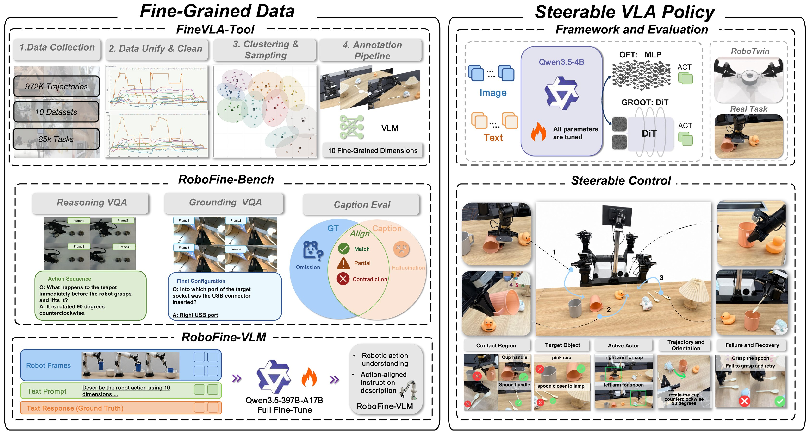

<p align="center">
  
</p>

<h1 align="center">FineVLA: Fine-Grained Instruction Alignment<br>for Steerable Vision-Language-Action Policies</h1>

<p align="center">
  <b><a href="https://ericsxt.github.io/">Xintong Hu</a><sup>*x</sup> &nbsp; <a href="https://csgeekhuang.github.io/">Xuhong Huang</a><sup>*x</sup> &nbsp; Jinyu Zhang<sup>x</sup> &nbsp; Yutong Yao<sup>x</sup> &nbsp; Yuchong Sun<sup>q</sup> &nbsp; Qiuyue Wang<sup>q</sup></b><br>
  <b>Mingsheng Li<sup>q</sup> &nbsp; Sicheng Xie<sup>q</sup> &nbsp; Yitao Liu<sup>x</sup> &nbsp; Junhao Chen<sup>x</sup> &nbsp; Yixuan Chen<sup>x</sup> &nbsp; Yingming Zheng<sup>x</sup> &nbsp; Shuai Bai<sup>q</sup> &nbsp; Tao Yu<sup>&dagger;x</sup></b><br><br>
  <sup>x</sup>XLANG Lab, The University of Hong Kong &nbsp;&nbsp;&nbsp;&nbsp;
  <sup>q</sup>Qwen Team, Alibaba Inc.<br>
  &nbsp;&nbsp;&nbsp;&nbsp;&nbsp;&nbsp;&nbsp;&nbsp;
  <br>
  <sup>*</sup>Equal contribution &nbsp; <sup>&dagger;</sup>Corresponding author
</p>

<p align="center">
  <a href="https://arxiv.org/abs/xxxx.xxxxx"></a>
  <a href="https://huggingface.co/xlangai/RoboFine-VLM-387B-A17B"></a>
  <a href="https://huggingface.co/datasets/xlangai/RoboFine-bench"></a>
  <a href="https://github.com/xlang-ai/FineVLA"></a>
  <a href="FineVLA-Policy/LICENSE"></a>
  <a href="https://www.python.org/downloads/"></a>
</p>

## Updates

- **2026-05-26:** FineVLA-Tool, RoboFine-Bench, and FineVLA-Policy code released.
- **Coming soon:** RoboFine-VLM annotator and pretrained model checkpoints.

**FineVLA** is a unified, fully open-source framework for fine-grained instruction alignment in Vision-Language-Action (VLA) learning. We argue that to **steer** robot behavior, language must be aligned with the action choices that determine execution — not just *what* to do, but *how* to do it.

<p align="center">
  
</p>
<p align="center"><b>Figure 1: Overview of FineVLA.</b> FineVLA builds a closed loop for action-instruction alignment, connecting fine-grained data construction, robotic video understanding, scalable annotation, and steerable VLA policy learning. <b>Left:</b> FineVLA-Tool unifies heterogeneous robot trajectories from 10 open-source datasets, removes redundant demonstrations through clustering and sampling, and annotates representative trajectories with action-aligned descriptions across ten fine-grained dimensions. The resulting FineVLA-Data supports both RoboFine-Bench, which evaluates fine-grained robotic video understanding through Grounding VQA, Reasoning VQA, and Caption Evaluation, and RoboFine-VLM, a robotics-specialized VLM trained as a scalable annotator for new trajectories. <b>Right:</b> FineVLA-Policy is trained with mixtures of raw goal-level instructions and fine-grained process-level instructions under two action-decoding architectures, and is evaluated in both RoboTwin simulation and real-world dual-arm manipulation. The steerable-control examples illustrate how fine-grained language specifies execution-sensitive factors such as contact region, target object, active actor, trajectory and orientation, and failure recovery.</p>

## Highlights

- **Fine-grained supervision improves both goal-level success and steerable control.** Mixed FG:Raw = 1:1 reaches **86.8%** in RoboTwin simulation and **62.7/100** in real-world dual-arm manipulation, compared with 49.9 for Raw-only.
- **Inverted-U mixing trend.** Fine-grained and raw goal-level instructions are complementary — the optimal ratio (FG:Raw = 1:2 to 1:1) consistently outperforms either alone, across architectures, data scales, and sim-to-real transfer.
- **Steerable control gains.** In real-world evaluation, the largest improvements appear on execution-sensitive factors: Pose (+23), Color (+18), and Approach Direction (+18) — precisely the factors where goal-level instructions provide no guidance.
- **Complete open-source release.** Data pipeline, 47K fine-grained annotations, benchmark, VLM annotator, model checkpoints, and training code.

## Release Progress

| Component | Description | Status |
|-----------|-------------|:---:|
| [**FineVLA-Tool**](FineVLA-Tool/) | Data construction pipeline: format unification, clustering, and fine-grained annotation | Released |
| [**RoboFine-Bench**](RoboFine-Bench/) | Fine-grained robotic video understanding benchmark (500 videos, 10,816 facts, 1,030 VQA questions) | Released |
| [**FineVLA-Policy**](FineVLA-Policy/) | VLA policy training with fine-grained instruction supervision (StarVLA-based) | Released |
| **RoboFine-VLM** | Robotics-specialized VLM annotator (fine-tuned Qwen3.5-397B-A17B) | Coming Soon |
| **Model Checkpoints** | Pretrained and fine-tuned policy checkpoints on HuggingFace | Coming Soon |

## Getting Started

### Clone the Repository

```bash
git clone https://github.com/xlang-ai/FineVLA.git
cd FineVLA
```

### FineVLA-Tool

See [FineVLA-Tool/README.md](FineVLA-Tool/README.md) for the data construction pipeline.

### RoboFine-Bench

Benchmark data is hosted on HuggingFace: [FineVLA/RoboFine-Bench](https://huggingface.co/datasets/xlangai/RoboFine-bench)

See [RoboFine-Bench/README.md](RoboFine-Bench/README.md) for evaluation code and instructions.

### FineVLA-Policy

See [FineVLA-Policy/README.md](FineVLA-Policy/README.md) for training and evaluation. Quick start:

```bash
cd FineVLA-Policy

# Install
conda create -n finevla python=3.10 -y && conda activate finevla
pip install -r requirements.txt
pip install flash-attn --no-build-isolation
pip install -e .

# Smoke test
python starVLA/model/framework/QwenGR00T.py

# Train (example: ALOHA with FG:Raw=1:1)
bash examples/Aloha/run_qwen35_GR00T_aloha_multi_FG1_1_dlc.sh
```

## Framework Overview

FineVLA addresses three key gaps in building steerable VLA systems:

### 1. FineVLA-Tool + FineVLA-Data

**Problem:** Heterogeneous robot data with coarse, goal-level-only annotations.

FineVLA-Tool unifies **972,247 trajectories** across 85K tasks from 10 open-source datasets, reduces redundancy via DTW-based clustering, and annotates representative samples with process-level descriptions across **ten fine-grained dimensions**:

| Dimension | What it captures |
|-----------|-----------------|
| Action Sequence | Step-by-step execution order |
| Active Actor | Which arm / end-effector to use |
| Target Object | Object disambiguation |
| Initial Configuration | Starting state of objects and robot |
| Final Configuration | End state after manipulation |
| Contact & Approach | Where and how contact is made |
| Trajectory & Orientation | Motion path and tool orientation |
| Body Motion | Full-body or joint-level movement |
| Object Interaction | How objects relate during manipulation |
| Failure & Recovery | Error handling and recovery behavior |

The result is **FineVLA-Data**: 47,159 human-verified trajectories with fine-grained instructions, a **10.4x** increase in average instruction length (9.3 to 96.8 words).

| Source | Trajectories | Steps | Avg Words (Coarse) | Avg Words (FG) | Density |
|--------|:---:|:---:|:---:|:---:|:---:|
| BridgeData-V2 | 4,958 | 21,554 | 10.1 | 61.7 | 6.1x |
| BC-Z | 1,513 | 5,313 | 5.2 | 51.2 | 9.8x |
| RT-1 | 5,232 | 22,023 | 6.8 | 61.4 | 9.1x |
| Galaxea | 2,834 | 18,484 | 4.7 | 219.9 | 47.1x |
| RoboMIND-V1 | 4,605 | 20,341 | 8.6 | 72.8 | 8.5x |
| RoboMIND-V2 | 7,119 | 39,166 | 6.6 | 98.8 | 14.9x |
| RoboCOIN | 8,513 | 43,926 | 16.1 | 122.6 | 7.6x |
| RH20T | 1,387 | 5,560 | 7.9 | 92.1 | 11.7x |
| RDT | 1,275 | 8,437 | 16.9 | 114.0 | 6.7x |
| DROID | 9,723 | 35,802 | 8.0 | 90.9 | 11.3x |
| **Total** | **47,159** | **220,606** | **9.3** | **96.8** | **10.4x** |

### 2. RoboFine-Bench

**Problem:** No benchmark for fine-grained robotic video understanding.

RoboFine-Bench evaluates whether VLMs capture execution-level manipulation details through two tracks:

- **VQA Track** — 1,030 questions across three axes: Entity & Scene Grounding, Action & Motion Understanding, Interaction & State Reasoning
- **Caption Track** — Step-level action description with Consistency, Coverage, and Anti-Hallucination metrics under Easy (with instruction) and Hard (vision-only) settings

**500 held-out videos** from 10 datasets, **32 embodiments**, **10,816 atomic facts** — strictly disjoint from all training data.

For detailed benchmark description, evaluation code, and results, see [RoboFine-Bench on HuggingFace](https://huggingface.co/datasets/xlangai/RoboFine-bench).

### 3. RoboFine-VLM

**Problem:** General-purpose VLMs miss execution-level details critical for action-instruction alignment.

RoboFine-VLM is obtained by fine-tuning Qwen3.5-397B-A17B on FineVLA-Data. It achieves **71.0%** VQA accuracy and **83.6%** caption Overall (hard setting) on RoboFine-Bench, outperforming GPT-5.4, Gemini-3.1-Pro, and other strong baselines. It serves as a scalable annotator for extending fine-grained supervision to new trajectories.

### 4. FineVLA-Policy

**Problem:** Unknown whether fine-grained supervision improves policy learning, and what mixing ratio works best.

FineVLA-Policy trains VLA policies under two architectures (StarVLA-OFT and StarVLA-GR00T) with systematic FG:Raw instruction mixing. Key findings:

**RoboTwin Simulation:**

| FG:Raw | RDT-OFT (Easy/Hard) | RDT-GR00T (Easy/Hard) | AlohaMix-OFT (Easy/Hard) |
|:---:|:---:|:---:|:---:|
| Raw-only | 61.5 / 60.0 | 55.1 / 53.4 | 71.8 / 71.4 |
| FG:Raw = 1:4 | 68.2 / 66.5 | 58.2 / 55.7 | 75.3 / 74.3 |
| FG:Raw = 1:2 | **74.1** / 72.1 | 61.7 / 60.9 | 82.8 / 78.6 |
| FG:Raw = 1:1 | 73.9 / **72.4** | **69.4** / **68.2** | **86.8** / **82.5** |
| FG:Raw = 2:1 | 70.4 / 68.3 | 65.9 / 63.1 | 80.9 / 79.3 |
| FG:Raw = 4:1 | 68.6 / 67.5 | 64.9 / 63.2 | 79.5 / 78.5 |
| FG-only | 62.9 / 62.0 | 62.1 / 61.5 | 78.3 / 76.1 |

**Real-World Dual-Arm (100-point scale):**

| Supervision | Clean Table | Stack Block | Color | Pose | Approach | Rotate | Arm | L→R (OOD) | Avg (ID) | Avg (All) |
|:---:|:---:|:---:|:---:|:---:|:---:|:---:|:---:|:---:|:---:|:---:|
| Raw-only | 72 | 35 | 22 | 24 | 60 | 76 | 60 | 0 | 49.9 | 43.6 |
| FG:Raw = 1:4 | 76 | 36 | 28 | 32 | 65 | 79 | 61 | 0 | 53.9 | 47.1 |
| FG:Raw = 1:2 | 79 | 39 | 36 | **48** | 76 | **87** | 63 | 5 | 61.1 | 54.1 |
| FG:Raw = 1:1 | **84** | **40** | **40** | 47 | **78** | 86 | **64** | **10** | **62.7** | **56.1** |
| FG:Raw = 2:1 | 80 | 38 | 34 | 42 | 72 | 83 | 62 | 5 | 58.7 | 52.0 |
| FG:Raw = 4:1 | 74 | 37 | 31 | 43 | 72 | 83 | 62 | 5 | 57.4 | 50.9 |
| FG-only | 70 | 35 | 25 | 41 | 70 | 80 | 60 | 0 | 54.4 | 47.6 |

## Citation

```bibtex
@article{finevla2026,
  title   = {FineVLA: Fine-Grained Instruction Alignment for Steerable Vision-Language-Action Policies},
  author  = {},
  journal = {arXiv preprint arXiv:XXXX.XXXXX},
  year    = {2026}
}
```

## Acknowledgements

FineVLA-Policy is built on [StarVLA](https://github.com/starVLA/starVLA). We also gratefully acknowledge [LeRobot](https://github.com/huggingface/lerobot), [GR00T](https://github.com/NVIDIA/Isaac-GR00T), [DeepSpeed](https://github.com/deepspeedai/DeepSpeed), and [Qwen-VL](https://github.com/QwenLM/Qwen3-VL).

## License

This project is released under the [MIT License](FineVLA-Policy/LICENSE).

- **Code, tools, and pipeline:** MIT License
- **Benchmark data:** Available on [HuggingFace](https://huggingface.co/datasets/xlangai/RoboFine-bench)

## Disclaimer

The authors are not responsible for any misuse of this project. The framework and associated tools are intended for research purposes in controlled environments. Use of the FineVLA name does not imply endorsement by the authors.
