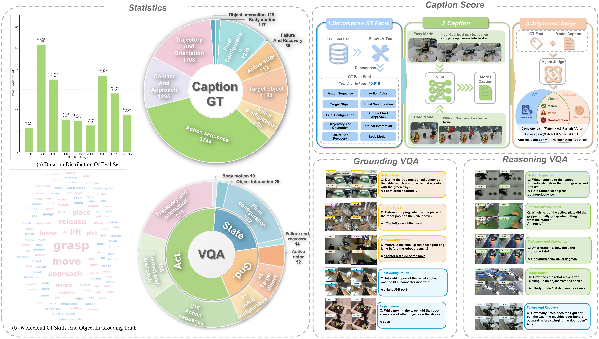

# RoboFine-Bench

Evaluation code for **RoboFine-Bench** — a benchmark for fine-grained robotic manipulation video understanding.

- **500 held-out videos** from 10 datasets, **32 embodiments**
- **VQA Track**: 1,030 questions across 3 axes (Grounding, Action & Motion, Interaction & State)
- **Caption Track**: Step-level action description with Consistency, Coverage, and Anti-Hallucination metrics

<p align="center">
  
</p>

## 1. Download Data

Benchmark data is hosted on Hugging Face: [xlangai/RoboFine-bench](https://huggingface.co/datasets/xlangai/RoboFine-bench)

```bash
cd RoboFine-Bench/

# Install Git LFS (required for video files)
git lfs install

# Clone the dataset into EvalData/ directory
git clone https://huggingface.co/datasets/xlangai/RoboFine-bench EvalData/
```

After download, your directory should look like:

```
RoboFine-Bench/
├── EvalData/                          # Downloaded from HuggingFace
│   ├── EvalSets.json                  # Evaluation samples with GT annotations
│   ├── QAEvalSets.json                # VQA questions and answers
│   ├── GT_AtomicFacts.jsonl           # Pre-extracted GT atomic facts
│   └── videos/                        # Robot manipulation videos
│       ├── BridgeDataV2/
│       ├── BC-Z/
│       └── ...
├── vqa_eval/                          # VQA evaluation code
└── caption_eval/                      # Caption evaluation code
```

## 2. Installation

```bash
pip install openai httpx tqdm pydantic Pillow av
```

Set your API key (DashScope or OpenAI-compatible endpoint):

```bash
export OPENAI_API_KEY="your-api-key"
```

## 3. VQA Evaluation

The VQA track tests whether VLMs can answer fine-grained questions about robot manipulation videos.

### Single Model

```bash
python RoboFine-Bench/vqa_eval/run_vqa.py \
    --model qwen3-vl-plus \
    --qa EvalData/QAEvalSets.json \
    --input EvalData/EvalSets.json \
    --num-workers 16
```

**Key arguments:**

| Argument | Default | Description |
|----------|---------|-------------|
| `--model` | `qwen3-vl-plus` | VLM model name |
| `--qa` | `EvalData/QAEvalSets.json` | VQA questions file |
| `--input` | `EvalData/EvalSets.json` | Evaluation samples file |
| `--base-url` | DashScope URL | API endpoint |
| `--num-workers` | `1` | Parallel API call threads |
| `--thinking` | `true` | Enable model reasoning mode |
| `--round` | `None` | Round number (for multi-round evaluation) |
| `--dry-run` | `False` | Print stats only, no API calls |

**Output:** `vqa_eval/results/{model}_vqa_result.jsonl`

### Multi-Round Batch Evaluation

```bash
# Run 2 rounds for all built-in models
bash RoboFine-Bench/vqa_eval/run_vqa_eval.sh 2

# Run 3 rounds, limit to first 10 samples
bash RoboFine-Bench/vqa_eval/run_vqa_eval.sh 3 10
```

### Generate Score Report

```bash
# Print single model report
python RoboFine-Bench/vqa_eval/vqa_report.py vqa_eval/results/xxx_vqa_result.jsonl

# Update cross-model summary CSV
python RoboFine-Bench/vqa_eval/vqa_report.py --update-csv
```

**Output:** `vqa_eval/results/VQATest_Score.csv` with per-capability and per-answer-type accuracy.

Supports resume: already-evaluated questions are automatically skipped on re-run.

## 4. Caption Evaluation

The Caption track evaluates step-level action description quality through atomic fact alignment. It runs in two stages: **(A) Generate captions** → **(B) Score against GT atomic facts**.

### Official Caption Benchmark Setting

Use the following setting for the main RoboFine-Bench Caption benchmark. Runs that change any of these items should be reported as ablations, not as the default benchmark score.

| Item | Fixed setting |
|------|---------------|
| Evaluation split | `EvalData/EvalSets.json`, 500 samples |
| View input | Use **all available views** for every sample, preserving the original `200/100/200` distribution of 1-view/2-view/3-view samples |
| View order | Follow `meta.view_names` order in `EvalSets.json`; do not drop wrist/side views |
| View labels | Preserve `[View: ...]` text labels before each view |
| Main leaderboard mode | **Hard mode**: do not include `instruction_raw` in the prompt |
| Optional mode | **Easy mode**: include `instruction_raw` in the prompt; report separately from Hard |
| Prompt/PE | Current RB new prompt in `caption_eval/annotate/prompts.py` |
| FPS | `fps=4` for both video and image/frame inputs |
| Input tracks | Report `MV-Video` and `MV-Image` separately |
| Pixel parameters | Do **not** explicitly set `min_pixels`, `max_pixels`, `total_pixels`, or `mm_processor_kwargs` |
| Output format | JSON only, parsed into `caption_result: ["step 1", "step 2", ...]` |
| Required completion | Report 500 successful caption generations and the number of scored samples |
| Scoring | Direct Alignment against `EvalData/GT_AtomicFacts.jsonl`; judge LLM must be reported |

The default leaderboard benchmark is intentionally instruction-free. This tests whether a model can infer the fine-grained manipulation procedure from visual evidence alone. Users may also run Easy mode to measure performance with task instruction context, but Easy and Hard scores should be reported separately. Single-view input, AP prompts, custom pixel settings, and alternative view distributions are useful ablations, but they should be named and reported separately.

Two official input tracks are supported:

| Track | Input representation | Notes |
|-------|----------------------|-------|
| `MV-Video` | Direct video URLs, one video per available view | Preferred when the model API accepts video parts directly |
| `MV-Image` | Decoded or pre-uploaded image frames, grouped by view | Use the same `fps=4`; if using a frame index, keep it fixed across models |

### Stage A: Generate Captions

Main benchmark, `MV-Video` track:

```bash
export OPENAI_API_KEY="your-api-key"

python RoboFine-Bench/caption_eval/run_caption_benchmark.py \
    --model qwen3.5-plus \
    --adapter openai-compatible \
    --base-url https://dashscope.aliyuncs.com/compatible-mode/v1 \
    --mode hard \
    --input-type video \
    --num-workers 16
```

Main benchmark, `MV-Image` track:

```bash
export OPENAI_API_KEY="your-api-key"

python RoboFine-Bench/caption_eval/run_caption_benchmark.py \
    --model qwen3.5-plus \
    --adapter openai-compatible \
    --base-url https://dashscope.aliyuncs.com/compatible-mode/v1 \
    --mode hard \
    --input-type image \
    --num-workers 16
```

Do not pass model-specific pixel overrides such as `min_pixels`, `max_pixels`, `total_pixels`, or `mm_processor_kwargs` for the official benchmark setting. If a model requires such parameters to run, include them in the experiment name and report the run as a non-standard pixel configuration.

`run_caption_benchmark.py` is the recommended entry point for new evaluations. It fixes all available views, `fps=4`, RB new prompt, and no explicit pixel overrides. It defaults to `--mode hard`; use `--mode easy` to include task instructions and report Easy scores separately. The older `caption_eval/annotate/run_annotate.py` script remains available for ablations.

### Custom Model Adapters

Model-specific code is isolated under `caption_eval/adapters/`. The benchmark runner owns data loading, view labels, prompt construction, output parsing, and result formatting; adapters only translate a standardized request into a model/API call.

Built-in adapter:

| Adapter | Use case |
|---------|----------|
| `openai-compatible` | DashScope compatible-mode, OpenAI-compatible vLLM servers, OpenAI-style multimodal chat APIs |

For a non-compatible API or local model, copy `caption_eval/adapters/local_example.py`, implement `generate_caption()`, and register it in `caption_eval/adapters/__init__.py`. A custom adapter receives a `CaptionRequest` with ordered views, view labels, video URLs, image parts, `fps=4`, and the RB new prompt for the selected mode. It must return raw model text and optional token usage; the benchmark runner will parse the JSON into `caption_result`.

### Evaluate Your Own VLM

There are three supported ways to evaluate a new VLM.

**Option 1: Your model exposes an OpenAI-compatible API**

Use the built-in `openai-compatible` adapter. This works for DashScope compatible-mode, OpenAI-compatible vLLM servers, and similar multimodal chat APIs.

```bash
export OPENAI_API_KEY="your-api-key"

python RoboFine-Bench/caption_eval/run_caption_benchmark.py \
    --model your-model-name \
    --adapter openai-compatible \
    --base-url http://your-server:8000/v1 \
    --mode hard \
    --input-type video \
    --num-workers 16
```

Use `--input-type image` if your API does not support direct video parts but can accept image/frame inputs. Use `--mode easy` to include task instructions and report Easy scores separately.

**Option 2: Your model uses a custom API or local inference code**

Copy the template adapter and implement one method:

```bash
cp RoboFine-Bench/caption_eval/adapters/local_example.py \
   RoboFine-Bench/caption_eval/adapters/my_model.py
```

Implement `generate_caption()` in `my_model.py`. The method receives a `CaptionRequest`:

```python
def generate_caption(self, request):
    # request.views: ordered multi-view metadata with view labels
    # request.video_urls: one video URL per view for video mode
    # request.image_parts: interleaved [View: ...] text and image_url parts for image mode
    # request.prompt: RB new prompt for the selected hard/easy mode
    # request.fps: fixed to 4
    ...
    return CaptionResponse(
        text=model_output_text,
        token_usage={"prompt_tokens": 0, "completion_tokens": 0, "total_tokens": 0},
    )
```

Register the adapter in `caption_eval/adapters/__init__.py`, then run:

```bash
python RoboFine-Bench/caption_eval/run_caption_benchmark.py \
    --model your-model-name \
    --adapter my-model \
    --mode hard \
    --input-type image \
    --num-workers 1
```

**Option 3: You already have caption outputs**

Skip caption generation and write a `CaptionResult.jsonl` file directly. Each line should include:

```json
{"sample_id": "sample-id", "caption_result": ["step 1", "step 2"], "call_success": true}
```

Then run Direct Alignment scoring with your chosen judge LLM:

```bash
python -m caption_eval.atomic_eval.atomic_eval direct-align \
    --gt-facts EvalData/GT_AtomicFacts.jsonl \
    --caption path/to/your_CaptionResult.jsonl \
    --output-dir caption_eval/result/DirectAlign/hard_video/your-model \
    --model openai.gpt-5.4-2026-03-05 \
    --base-url https://dashscope.aliyuncs.com/compatible-mode/v1 \
    --num-workers 8 \
    --enable-thinking
```

For all options, report the mode (`hard` or `easy`), input track (`MV-Video` or `MV-Image`), judge LLM, number of successful caption generations, number of scored samples, and token usage if available.

Or use the batch script:
```bash
bash RoboFine-Bench/caption_eval/annotate/run_annotation_eval.sh easy    # with instruction
bash RoboFine-Bench/caption_eval/annotate/run_annotation_eval.sh hard    # without instruction
```

**Output:** `{output_dir}/{model}_CaptionResult.jsonl`

### Stage B: Score Captions

Score the generated captions against ground-truth atomic facts using Direct Alignment:

```bash
export OPENAI_API_KEY="your-api-key"

python -m caption_eval.atomic_eval.atomic_eval direct-align \
    --gt-facts EvalData/GT_AtomicFacts.jsonl \
    --caption caption_eval/result/caption/hard_video/qwen3_5-plus_CaptionResult.jsonl \
    --output-dir caption_eval/result/DirectAlign/hard_video/qwen3_5-plus \
    --model openai.gpt-5.4-2026-03-05 \
    --base-url https://dashscope.aliyuncs.com/compatible-mode/v1 \
    --num-workers 8 \
    --enable-thinking
```

The Direct Alignment judge can be GPT, Gemini, Claude, Qwen, or another instruction-following LLM exposed through a compatible API. Set the judge endpoint with `--model`, `--base-url`, and either `--api-key` or the `OPENAI_API_KEY` environment variable. For fair comparison, report the judge model and endpoint together with the caption score; scores produced by different judge LLMs should not be mixed without noting the judge difference.

**Scoring metrics:**

| Metric | Formula | What it measures |
|--------|---------|------------------|
| Consistency | (Match + 0.5×Partial) / Total Alignments | Precision of matched facts |
| Coverage | (Match + 0.5×Partial) / GT Facts | Recall of GT facts |
| Anti-Hallucination | 1 - Hallucinated / GT_action_sequence | Penalizes fabricated actions |
| **CaptionScore** | 1/3 × (Consistency + Coverage + Anti-Hallucination) | Overall score |

**Output:**
- `scored_results.jsonl` — Per-sample scores
- `dataset_summary.json` / `dataset_summary.csv` — Aggregated scores by dataset and capability

### Cross-Model Summary

```bash
python -m caption_eval.atomic_eval.atomic_eval summary \
    --results-dirs caption_eval/result/DirectAlign/hard_video/*/ \
    --output caption_eval/result/DirectAlign/cross_model_summary_hard_video.csv
```

Or use the batch script for all models:
```bash
bash RoboFine-Bench/caption_eval/run_direct_align.sh easy
bash RoboFine-Bench/caption_eval/run_direct_align.sh hard
```

## 5. Result Directory Structure

All evaluation results follow a fixed directory layout. The Visualization tool reads from these paths automatically.

```
RoboFine-Bench/
├── vqa_eval/
│   └── results/                                  # VQA evaluation results
│       ├── {model}_vqa_result.jsonl               # Per-question model answers
│       └── VQATest_Score.csv                      # Cross-model accuracy summary
│
├── caption_eval/
│   └── result/
│       ├── caption/                              # Generated captions
│       │   ├── easy/                             # With task instruction
│       │   │   └── {model}_CaptionResult.jsonl
│       │   └── hard/                             # Without task instruction
│       │       └── {model}_CaptionResult.jsonl
│       └── DirectAlign/                          # DirectAlign scoring results
│           ├── easy/
│           │   └── {model}/
│           │       ├── scored_results.jsonl       # Per-sample scores
│           │       ├── dataset_summary.json       # Aggregated scores
│           │       ├── dataset_summary.csv
│           │       └── direct_align_raw.jsonl     # Raw GPT alignment output
│           ├── hard/
│           │   └── {model}/
│           │       └── ...
│           ├── cross_model_summary_easy.csv       # Cross-model comparison
│           └── cross_model_summary_hard.csv
│
└── Visualization/                                # Result visualization web app
    ├── app.py
    ├── templates/index.html
    └── static/{main.js, style.css}
```

## 6. Visualization

A Flask-based web app for browsing samples, viewing model captions, VQA results, and DirectAlign scores side-by-side.

```bash
pip install flask
cd RoboFine-Bench/Visualization
python app.py
# Open http://localhost:5001
```

Features:
- Browse all 500 samples with video playback (multi-view sync)
- **Caption & Atomic Eval tab**: Select a model to view its caption vs GT, with per-capability DirectAlign breakdown (Match/Partial/Contradiction/Omission/Hallucination)
- **VQA tab**: Cross-model answer comparison table grouped by capability
- **Basic Info tab**: GT annotations, fine-grained steps, QA pairs

The app reads results from the paths defined in Section 5 using **relative paths** — no configuration needed. After running evaluations, simply restart the app to see new results.

## 7. Project Structure

```
RoboFine-Bench/
├── benchmark_overview.png             # Benchmark overview figure
├── prepare_frames.py                  # Pre-extract video frames to images
├── eval_set/
│   └── prepare_evalsets_input.py      # Data preparation (internal use)
├── vqa_eval/
│   ├── run_vqa.py                     # VQA evaluation runner
│   ├── vqa_eval.py                    # Answer matching logic
│   ├── vqa_config.py                  # Dataset view/FPS configuration
│   ├── vqa_prompts.py                 # VQA prompt templates
│   ├── vqa_report.py                  # Score reporting & CSV
│   ├── run_vqa_eval.sh               # Batch multi-round evaluation
│   └── run_video_eval.sh             # Video mode evaluation (3 models)
├── caption_eval/
│   ├── annotate/
│   │   ├── run_annotate.py            # Caption generation runner
│   │   ├── api_call.py                # Unified API client (Qwen/Gemini/GPT)
│   │   ├── prompts.py                 # Caption prompt templates
│   │   └── run_annotation_eval.sh     # Batch caption generation
│   ├── run_direct_align.sh            # Batch Direct Alignment scoring
│   └── atomic_eval/
│       ├── run_judge.py               # LLM-as-a-Judge (legacy method)
│       ├── prompts/                   # Judge prompt templates
│       └── atomic_eval/              # Core evaluation package
│           ├── cli.py                 # CLI subcommands
│           ├── pipeline.py            # Evaluation pipeline
│           ├── scoring.py             # Metric computation
│           └── ...
└── Visualization/
    ├── app.py                         # Flask backend (relative paths)
    ├── templates/index.html           # Web UI
    └── static/                        # JS + CSS
```

## 8. Supported Models

The evaluation scripts support multiple VLM providers out of the box:

| Provider | Model Examples |
|----------|---------------|
| Qwen (DashScope) | `qwen3-vl-plus`, `qwen3.5-plus` |
| Google (Gemini) | `vertex_ai.gemini-3.1-pro-preview` |
| OpenAI | `openai.gpt-5.4-2026-03-05` |
| Doubao | `doubao.doubao-seed-2-0-pro-260215` |

## 9. DashScope API: Video Input Modes

> **Note:** This section documents DashScope-specific calling conventions for each model.

### Two Input Modes

| | Image List Mode | Video URL Mode |
|--|----------------|---------------|
| **How it works** | Client decodes video → sample frames at target FPS → base64 encode → send as per-frame image | Send .mp4 URL directly → model handles frame sampling internally |
| **Pros** | Full control over FPS, frame count, resolution | Extremely low token cost, no client-side decoding |
| **Cons** | High token cost (each frame tokenized independently) | FPS control depends on model/API support |
| **Prompt Tokens** | ~20K–86K per sample | ~700–2K per sample |

### Model Support Matrix

| Model | Image List | Video URL | Video Format | FPS Control | Approx Tokens (video) |
|-------|:---------:|:---------:|--------------|:-----------:|:---------------------:|
| **qwen3-vl-plus** | ✅ | ✅ | `{"type":"video", "video":"url.mp4", "fps":2.0}` | ✅ | TBD |
| **qwen3.5-plus** | ✅ | ✅ | Same as above | ✅ | TBD |
| **doubao-seed** | ✅ | ✅ | `{"type":"video_url"}` (model name + `-completion` suffix) | ✅ | ~1,918 |
| **gemini-3.1-pro** | ✅ | ✅ | Native `contents` + `fileData` (mimeType=video/mp4) | ✅ `videoMetadata.fps` | ~693 (1fps) |
| **gpt-5.4** | ✅ | ❌ | Requires `file_id` (no upload API via DashScope) | Client-side | N/A |

### Frame Limits (Image List Mode)

| Model | Max Frames | Reason |
|-------|-----------|--------|
| doubao-seed | 100 | Token limit ~128K |
| gpt-5.4 | 490 | API limit: 500 images/request |
| qwen / gemini | No hard limit | Video URL mode: model decides |

### Calling Conventions

**Qwen (Video URL):**
```json
{"type": "video", "video": "https://xxx.mp4", "fps": 2.0}
```

**Doubao (Video URL):**
- Model name must have `-completion` suffix: `doubao-seed-2-0-pro-260215-completion`
- Uses standard `messages` format with `video_url` type:
```json
{"type": "video_url", "video_url": {"url": "https://xxx.mp4"}}
```

**Gemini (Video URL):**
- Must use native `contents`/`fileData` format (NOT `messages` format)
- Supports FPS control via `videoMetadata.fps` (default: 1 fps)
```json
{"contents": [{"parts": [{"fileData": {"mimeType": "video/mp4", "fileUri": "https://xxx.mp4"}, "videoMetadata": {"fps": 2.0}}, {"text": "..."}], "role": "user"}]}
```

**GPT-5.4 (Image List only):**
- Only supports `image_url` type (per-frame images)
- `video_url` and `file` type both require pre-uploaded `file_id`, which DashScope does not provide

### Token Cost Comparison (same video, single sample)

| Mode | doubao-seed | gemini-3.1-pro | gpt-5.4 |
|------|:-----------:|:--------------:|:-------:|
| Image List | ~85,900 | ~5,000 | ~20,000 |
| Video URL (0.5 fps) | — | **315** | N/A |
| Video URL (1 fps) | — | **693** | N/A |
| Video URL (2 fps) | **1,918** | **1,323** | N/A |

## 10. Evaluate RoboFine-VLM (Local vLLM)

RoboFine-VLM is a Qwen3.5-397B-A17B SFT model. This section covers local deployment via vLLM and running both VQA and Caption evaluations.

### Deploy vLLM

```bash
unset http_proxy https_proxy HTTP_PROXY HTTPS_PROXY

nohup python -m vllm.entrypoints.openai.api_server \
  --model /path/to/RoboFine-VLM-opensource \
  --host 0.0.0.0 --port 8000 \
  --tensor-parallel-size 8 \
  --max-model-len 262144 \
  --reasoning-parser qwen3 \
  --dtype bfloat16 \
  --enforce-eager \
  --limit-mm-per-prompt '{"image": 1700}' \
  --additional-config '{"gdn_prefill_backend": "triton"}' \
  > vllm_server.log 2>&1 &
```

> **Kill vLLM:** `pkill -9 -f "VLLM::"` (must use uppercase `VLLM` to match EngineCore and Worker processes).

### Caption Evaluation

RoboFine-VLM uses **image list mode** (client-side PyAV decode + base64 frames) because vLLM's OpenCV backend cannot decode AV1-encoded videos (8/10 datasets use AV1).

**Configuration (aligned with SFT training-time settings):**

| Parameter | Value | Notes |
|-----------|-------|-------|
| `input-type` | `image` | Client-side PyAV decode, base64 frames |
| `fps` | `4.0` | Frames per second |
| `max_frames` | `512` | Per-view frame cap |
| `resize_width` | `512` | Frames wider than 512px are proportionally downscaled |
| `temperature` | `0.0` | Deterministic output |
| `top_p` | `0.95` | |
| `max_tokens` | `32768` | |
| `enable_thinking` | `False` | Consistent with SFT inference |
| Multi-view | All views kept | 3-view samples send all 3 views (no filtering) |

**Run Easy mode (with task instruction):**
```bash
export OPENAI_API_KEY=EMPTY

python caption_eval/annotate/run_annotate.py \
    --model /path/to/RoboFine-VLM-opensource \
    --base-url http://localhost:8000/v1 \
    --input-type image \
    --fps 4 \
    --video-dir EvalData/videos \
    --output-dir caption_eval/result/caption/easy \
    --num-workers 2
```

**Run Hard mode (without task instruction):**
```bash
python caption_eval/annotate/run_annotate.py \
    --model /path/to/RoboFine-VLM-opensource \
    --base-url http://localhost:8000/v1 \
    --input-type image \
    --fps 4 \
    --video-dir EvalData/videos \
    --output-dir caption_eval/result/caption/hard \
    --num-workers 2 \
    --no-instruction
```

> **Concurrency:** Use `--num-workers 2` for local vLLM. Higher concurrency (4+) may cause request timeouts on 3-view samples (~77K tokens each).

**Score with GPT (Direct Alignment):**
```bash
python -m caption_eval.atomic_eval.atomic_eval direct-align \
    --gt-facts EvalData/GT_AtomicFacts.jsonl \
    --caption caption_eval/result/caption/easy/xxx_CaptionResult.jsonl \
    --output-dir caption_eval/result/DirectAlign/easy/RoboFine-VLM/ \
    --num-workers 8 \
    --enable-thinking
```

### VQA Evaluation

```bash
export OPENAI_API_KEY=EMPTY

python vqa_eval/run_vqa.py \
    --model /path/to/RoboFine-VLM-opensource \
    --base-url http://localhost:8000/v1 \
    --input-type image \
    --fps 4 \
    --thinking false \
    --num-workers 8
```

### Notes

- **AV1 video codec:** Most benchmark videos use AV1 encoding. vLLM's OpenCV cannot decode AV1, so `--input-type image` is required (client-side PyAV handles AV1).
- **Frame resize:** Frames are resized to 512px width (preserving aspect ratio) to match SFT training conditions and stay within the 262K token context limit.
- **Resume:** Both scripts support automatic resume — already-completed samples are skipped on re-run.

## 11. Evaluate Your Own Model

### Custom Model

To evaluate your own VLM, implement the `BaseVLM` interface and pass it via `--model-class`:

```python
# my_model.py
from models.base_model import BaseVLM
from PIL import Image
from typing import Dict, List, Tuple

class MyVLM(BaseVLM):
    def __init__(self, model_path: str):
        # Load your model weights
        self.model = load_my_model(model_path)

    def generate(self, images: List[Image.Image], prompt: str, system_prompt: str = "") -> Tuple[str, Dict]:
        # images: video frames sampled at target FPS, ordered chronologically
        # Return (response_text, token_usage_dict)
        output = self.model.inference(images, prompt)
        return output, {"prompt_tokens": 0, "completion_tokens": 0, "total_tokens": 0}
```

Run evaluation:

```bash
# Evaluate custom model (downloads videos and decodes at 2 fps)
python vqa_eval/run_vqa.py \
    --model-class my_model.MyVLM \
    --model-path /path/to/weights \
    --fps 2 \
    --num-workers 4

# Use pre-extracted frames (faster, no download needed)
python prepare_frames.py --input EvalData/EvalSets.json --output frames/ --fps 2
python vqa_eval/run_vqa.py \
    --model-class my_model.MyVLM \
    --model-path /path/to/weights \
    --frames-dir frames/ \
    --num-workers 4
```

| Argument | Description |
|----------|-------------|
| `--model-class` | Python import path to your model class (e.g., `my_model.MyVLM`) |
| `--model-path` | Path passed to the model constructor (weights, config, etc.) |
| `--frames-dir` | Optional: pre-extracted frames directory (skips video download/decode) |

### Input Modes

Both VQA and Caption evaluation support two input modes:

| | Video Mode | Image List Mode |
|--|-----------|----------------|
| **How** | Send `.mp4` URL directly to the model | Client decodes video at target FPS, sends frames as image list |
| **Pros** | Low token cost, no client-side decoding | Works with any model, full control over frames |
| **Cons** | Requires model to accept video input | Higher token cost (each frame tokenized independently) |

**Default FPS settings:**

| Track | FPS | Rationale |
|-------|-----|-----------|
| **VQA** | 2 | Coarse temporal understanding suffices for most questions |
| **Caption** | 4 | Finer temporal resolution needed for step-level action description |

### API Models

Use `--input-type` to select the mode for supported API models:

```bash
# VQA — Video mode (recommended, lower tokens)
python vqa_eval/run_vqa.py \
    --model qwen3-vl-plus \
    --input-type video --fps 2 \
    --num-workers 16

# VQA — Image list mode (fallback for models without video support)
python vqa_eval/run_vqa.py \
    --model openai.gpt-5.4-2026-03-05 \
    --input-type image \
    --num-workers 16

# Batch evaluation (3 models, video mode)
nohup bash vqa_eval/run_video_eval.sh --workers 16 > logs/video_eval.log 2>&1 &
```

## Data

Benchmark data is hosted on Hugging Face: [xlangai/RoboFine-bench](https://huggingface.co/datasets/xlangai/RoboFine-bench)

| File | Description |
|------|-------------|
| `EvalSets.json` | 500 evaluation samples with GT step annotations, video URLs, and metadata |
| `QAEvalSets.json` | 1,030 VQA questions with answers, capabilities, and answer types |
| `GT_AtomicFacts.jsonl` | Pre-extracted GT atomic facts across 10 capability dimensions |
| `frame_index.jsonl` | Pre-uploaded frame URLs for efficient Caption generation |
| `Videos/` | Robot manipulation video files organized by dataset |
